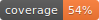

# Iconify

 
 
 


Iconify provides a way of creating `QIcon`'s and `QPixmaps`'s from svg files with
additional hooks for overriding the color and providing animation.

## Quickstart

To get started with iconify, use the following commands:

```shell script
# Install iconify
pip install iconify

# Fetch the icon libraries - Font Awesome, Material Design etc.
iconify-fetch

# Start the icon browser to find the icon you want
iconify-browser
```

Once you have the icon browser open, you'll be able to copy the name of the icon
you want and then dive into python:

```python
import iconify as ico

icon = ico.Icon('fa:brands:github')
myQtButton.setIcon(icon)
```

## Configuration

Iconfiy will search paths identified by the `ICONIFY_PATH` environment variable.
You can also set this at runtime with the following code:

```python
import iconify as ico

ico.path.addIconDirectory('/path/to/icon/dir')
```

You will also require a Qt python binding such as `PySide2`. Iconify will use the 
binding identified by the `ICONIFY_QTLIB` environment variable.  Set this variable
to the name required to import the python binding e.g. `PySide2` or `PyQt5`. 
Iconify expects Qt5 namespaces so if you'd like to use this library with Qt4
you should consider using a shim such as `Qt.py` or `QtPy`.


## Examples

### Simple

The following code will find the first occurrence of a `delete.svg` file on the
`ICONIFY_PATH` environment variable and use it as is.
 
```python
import iconify as ico

icon = ico.Icon('delete')
button.setIcon(icon)
```

### Changing Color

To set the color of the icon, provide a `QColor` object via the `color` kwarg:

```python
import iconify as ico

icon = ico.Icon('filters', color=QtGui.QColor('salmon'))
button.setIcon(icon)
```

### Animation

For animation, instantiate an animation object and pass it in via the `anim` kwarg:

```python
import iconify as ico

anim = ico.anim.Spin()
icon = ico.Icon(
    # The ':' here denotes a directory and provides cross platform support.
    'spinners:simple',  
    color=QtGui.QColor('lightblue'),
    anim=anim,
)

# `icon.setAsButtonIcon` is used here so that the animation
# used by the icon will update the widget when it plays.
icon.setAsButtonIcon(button)

# Start the animation
anim.start()
```

### Advanced Animation

The same animation object can be used with multiple icons, and the same icon can be applied
to multiple buttons.  This is useful when you want numerous widgets to update when 
an event happens e.g. loading something:

```python
import iconify as ico

# Animations can be added together using the + operator.
loadingAnim = ico.anim.Spin() + ico.anim.Breathe()

# Instantiate two icons with the same animation
simpleIcon = ico.Icon(
    'spinners:simple',
    color=QtGui.QColor('lightblue'),
    anim=loadingAnim,
)
detailedIcon = ico.Icon(
    'spinners:detailed',
    color=QtGui.QColor('grey'),
    anim=loadingAnim,
)

# Use those icons on multiple buttons
simpleIcon.setAsButtonIcon(smallButtonOne)
simpleIcon.setAsButtonIcon(smallButtonTwo)
detailedIcon.setAsButtonIcon(largeButtonOne)
detailedIcon.setAsButtonIcon(largeButtonTwo)


def loadData():
    # Start the animation.  All buttons using the two icons
    # from above should start to animate.
    loadingAnim.start()
    
    # Do a long running process here, preferably in a separate
    # thread to keep the user interface refreshing nicely.
    
    # Stop the animation now that the work has been done.
    loadingAnim.stop()
```

### Pixmaps

It's also possible to use iconify to create pixmaps.  The following code is a 
custom `QLabel` subclass which using iconfiy to draw a pixmap in the center of
the label:

```python
import iconify as ico
from iconify.qt import QtCore, QtGui, QtWidgets


class IconifyLabel(QtWidgets.QLabel):

    def __init__(self, pixmapGenerator):
        super(IconifyLabel, self).__init__()
        self._pixmapGenerator = pixmapGenerator
        
        # Ensure this label updates when the animation ticks.
        self._pixmapGenerator.anim().tick.connect(self.update)

    def paintEvent(self, event):
        super(IconifyLabel, self).paintEvent(event)

        rect = event.rect()

        if rect.width() > rect.height():
            size = QtCore.QSize(rect.height(), rect.height())
        else:
            size = QtCore.QSize(rect.width(), rect.width())

        pixmap = self._pixmapGenerator.pixmap(size)

        painter = QtGui.QPainter(self)
        halfSize  = size / 2
        point = rect.center() - QtCore.QPoint(halfSize.width(), halfSize.height())
        painter.drawPixmap(point, pixmap)
        painter.end()


anim = ico.anim.Spin()
pixmapGenerator = ico.PixmapGenerator(
    'loading',
    color=QtGui.QColor('orange'),
    anim=anim,
)
label = IconifyLabel(pixmapGenerator)
anim.start()
```
